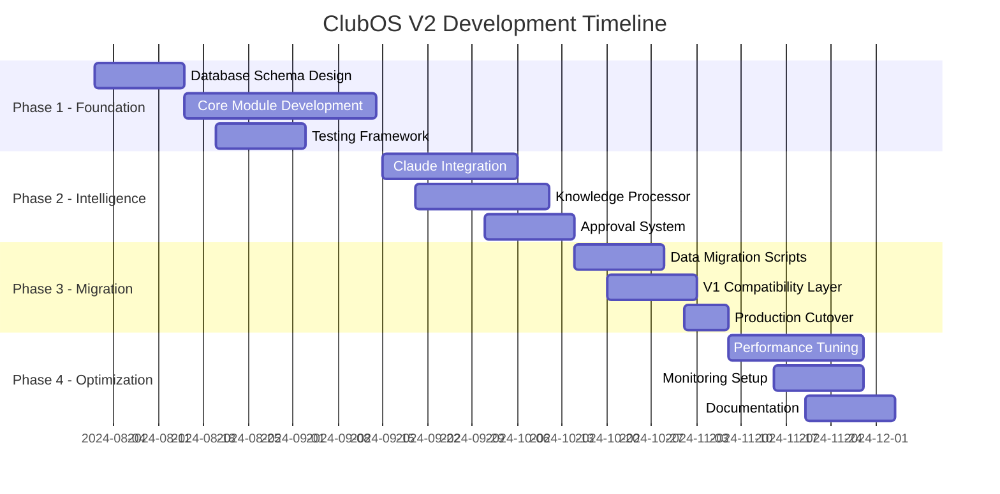

# ClubOS V2 Complete Technical Specification

## System Architecture Overview

### Core Architecture Pattern: Event-Sourced Microservices with CQRS

```
Event Stream (Kafka/PostgreSQL LISTEN/NOTIFY)
    ↓
Command Side (Write Path)           Query Side (Read Path)
├── RoutingCommand                  ├── ResponseQuery
├── KnowledgeUpdateCommand          ├── AnalyticsQuery
├── FeedbackCommand                 ├── MetricsQuery
└── ApprovalCommand                 └── HistoryQuery
```

## Module Specification

### 1. Core Routing Module (`/backend/src/modules/routing`)

#### 1.1 HybridRouter Service
```typescript
interface IHybridRouter {
  route(query: string, context: RoutingContext): Promise<RouteDecision>;
  updateEmbeddings(assistant: string, samples: string[]): Promise<void>;
  getRoutingMetrics(): Promise<RoutingMetrics>;
}

class HybridRouter implements IHybridRouter {
  private keywordMatcher: IKeywordMatcher;
  private semanticMatcher: ISemanticMatcher;
  private contextAnalyzer: IContextAnalyzer;
  private metricsCollector: IMetricsCollector;
  
  // Dependency injection for testability
  constructor(
    keywordMatcher: IKeywordMatcher,
    semanticMatcher: ISemanticMatcher,
    contextAnalyzer: IContextAnalyzer,
    metricsCollector: IMetricsCollector
  ) {}
}
```

#### 1.2 Routing Decision Engine
```typescript
interface RouteDecision {
  traceId: UUID;
  timestamp: Date;
  query: string;
  primaryRoute: {
    assistant: AssistantType;
    confidence: number;
    method: 'keyword' | 'semantic' | 'hybrid';
  };
  alternativeRoutes: Route[];
  contextFactors: {
    userHistory: boolean;
    locationContext: boolean;
    timeContext: boolean;
    emergencyOverride: boolean;
  };
  metadata: {
    keywordScore: number;
    semanticScore: number;
    processingTimeMs: number;
  };
}
```

#### 1.3 Emergency Detection Pipeline
```typescript
class EmergencyDetector {
  private patterns: RegExp[] = [
    /\b(fire|smoke|burning)\b/i,
    /\b(injury|hurt|bleeding|pain)\b/i,
    /\b(emergency|urgent|help)\b/i
  ];
  
  private contextualEmergency = new Map<string, number>([
    ['fire alarm', 0.95],
    ['medical emergency', 1.0],
    ['evacuation', 0.9]
  ]);
  
  detect(query: string): EmergencyDetection {
    // Fast path - regex matching
    // Slow path - contextual analysis
    // Return detection with confidence
  }
}
```

### 2. Knowledge Processing Module (`/backend/src/modules/knowledge`)

#### 2.1 Central Knowledge Processor
```typescript
interface IKnowledgeProcessor {
  intake(source: KnowledgeSource): Promise<IntakeResult>;
  classify(knowledge: RawKnowledge): Promise<Classification>;
  route(classification: Classification): Promise<RoutingResult>;
  audit(action: KnowledgeAction): Promise<void>;
}

enum KnowledgeSource {
  CUSTOMER_QUERY = 'customer_query',
  SLACK_RESPONSE = 'slack_response',
  MANUAL_ENTRY = 'manual_entry',
  FAILED_INTERACTION = 'failed_interaction',
  CLAUDE_SUGGESTION = 'claude_suggestion'
}

interface Classification {
  id: UUID;
  content: string;
  category: KnowledgeCategory;
  sensitivity: SensitivityLevel;
  targetAssistants: AssistantType[];
  confidence: number;
  metadata: ClassificationMetadata;
}
```

#### 2.2 Sensitive Data Vault
```typescript
class SensitiveDataVault {
  private encryptionKey: Buffer;
  private accessControl: IAccessControl;
  
  async store(data: SensitiveData): Promise<VaultReference> {
    const encrypted = await this.encrypt(data);
    const reference = await this.persistToVault(encrypted);
    await this.auditAccess('store', reference);
    return reference;
  }
  
  async retrieve(reference: VaultReference, accessor: User): Promise<SensitiveData | null> {
    if (!await this.accessControl.canAccess(accessor, reference)) {
      await this.auditAccess('denied', reference, accessor);
      return null;
    }
    // Decrypt and return
  }
}
```

### 3. Response Generation Module (`/backend/src/modules/response`)

#### 3.1 Tiered Response System
```typescript
class ResponseEngine {
  private tiers: ResponseTier[] = [
    new ExactMatchTier(),      // <50ms
    new SemanticCacheTier(),   // <200ms
    new DatabaseTier(),        // <500ms
    new GenerativeTier()       // <3000ms
  ];
  
  async generateResponse(
    query: string, 
    route: RouteDecision,
    context: ResponseContext
  ): Promise<Response> {
    for (const tier of this.tiers) {
      const result = await tier.attempt(query, route, context);
      if (result.success) {
        await this.updateMetrics(tier, result);
        return result.response;
      }
    }
    throw new NoResponseAvailableError();
  }
}
```

#### 3.2 Streaming Response Handler
```typescript
class StreamingResponseHandler {
  async stream(
    response: AsyncIterable<Token>,
    client: ResponseStream
  ): Promise<void> {
    const buffer = new TokenBuffer();
    
    for await (const token of response) {
      buffer.add(token);
      
      if (buffer.shouldFlush()) {
        await client.write(buffer.flush());
      }
    }
    
    await client.end(buffer.flush());
  }
}
```

### 4. Intelligence Engine Module (`/backend/src/modules/intelligence`)

#### 4.1 Claude Integration Service
```typescript
interface IClaudeIntelligence {
  analyzeFailures(failures: FailedInteraction[]): Promise<Analysis>;
  suggestImprovements(analysis: Analysis): Promise<Improvement[]>;
  generatePatch(improvement: Improvement): Promise<Patch>;
  validatePatch(patch: Patch): Promise<ValidationResult>;
}

class ClaudeIntelligenceEngine implements IClaudeIntelligence {
  private claude: AnthropicClient;
  private validator: IPatchValidator;
  private wal: IWriteAheadLog;
  
  async suggestImprovements(analysis: Analysis): Promise<Improvement[]> {
    // Semantic grouping of failures
    const groups = await this.groupFailures(analysis.failures);
    
    // Generate improvements per group
    const improvements = await Promise.all(
      groups.map(group => this.generateGroupImprovement(group))
    );
    
    // Validate and rank improvements
    return this.rankImprovements(improvements);
  }
}
```

#### 4.2 Write-Ahead Logging System
```typescript
class WriteAheadLog {
  async proposeChange(change: ProposedChange): Promise<WALEntry> {
    const entry: WALEntry = {
      id: uuid(),
      timestamp: new Date(),
      change,
      checksums: {
        before: await this.calculateChecksum(change.target),
        proposed: await this.calculateChecksum(change.newContent)
      },
      status: 'pending',
      rollback: this.generateRollback(change)
    };
    
    await this.persist(entry);
    return entry;
  }
  
  async commit(entryId: UUID, approval: Approval): Promise<CommitResult> {
    // Validate checksum hasn't changed
    // Apply change
    // Update status
    // Create immutable audit record
  }
}
```

### 5. Assistant Management Module (`/backend/src/modules/assistants`)

#### 5.1 Assistant Registry
```typescript
interface AssistantConfig {
  id: string;
  name: string;
  type: AssistantType;
  capabilities: Capability[];
  knowledgeDomains: string[];
  accessControl: AccessPolicy;
  embeddingModel: string;
  responseStrategy: ResponseStrategy;
}

class AssistantRegistry {
  private assistants: Map<AssistantType, IAssistant> = new Map([
    [AssistantType.EMERGENCY, new EmergencyAssistant()],
    [AssistantType.BOOKING, new BookingAssistant()],
    [AssistantType.TECH_SUPPORT, new TechSupportAssistant()],
    [AssistantType.PRICING, new PricingAssistant()],
    [AssistantType.LOCATIONS, new LocationsAssistant()],
    [AssistantType.BRAND_VOICE, new BrandVoiceAssistant()],
    [AssistantType.STRATEGY, new StrategyAssistant()],
    [AssistantType.CUSTOMER_INFO, new CustomerInfoAssistant()],
    [AssistantType.GENERAL, new GeneralAssistant()]
  ]);
  
  async getAssistant(type: AssistantType, context: AssistantContext): Promise<IAssistant> {
    const assistant = this.assistants.get(type);
    if (!assistant) throw new AssistantNotFoundError(type);
    
    // Verify access control
    if (!await this.verifyAccess(assistant, context)) {
      throw new AssistantAccessDeniedError(type, context.user);
    }
    
    return assistant;
  }
}
```

### 6. Caching Module (`/backend/src/modules/cache`)

#### 6.1 Multi-Tier Cache Architecture
```typescript
interface ICacheLayer {
  name: string;
  get(key: string): Promise<CacheResult | null>;
  set(key: string, value: any, ttl?: number): Promise<void>;
  invalidate(pattern: string): Promise<number>;
  getMetrics(): CacheMetrics;
}

class CacheOrchestrator {
  private layers: ICacheLayer[] = [
    new MemoryCache({ maxSize: 1000, ttl: 300 }),      // L1: 5 min
    new RedisCache({ ttl: 3600 }),                     // L2: 1 hour  
    new PostgresCache({ table: 'response_cache' })     // L3: persistent
  ];
  
  async get(key: string): Promise<CacheResult> {
    for (let i = 0; i < this.layers.length; i++) {
      const result = await this.layers[i].get(key);
      if (result) {
        // Promote to higher layers
        await this.promote(key, result.value, i);
        return { ...result, layer: i };
      }
    }
    return null;
  }
}
```

### 7. Monitoring & Observability Module (`/backend/src/modules/monitoring`)

#### 7.1 Metrics Collection
```typescript
interface IMetricsCollector {
  counter(name: string, value: number, tags?: Tags): void;
  gauge(name: string, value: number, tags?: Tags): void;
  histogram(name: string, value: number, tags?: Tags): void;
  timing(name: string, duration: number, tags?: Tags): void;
}

class MetricsService implements IMetricsCollector {
  private prometheus: PrometheusClient;
  private statsd: StatsDClient;
  
  timing(name: string, duration: number, tags?: Tags): void {
    // Send to Prometheus
    this.prometheus.histogram(name, duration, tags);
    
    // Send to StatsD for real-time
    this.statsd.timing(name, duration, tags);
    
    // Alert if threshold exceeded
    if (this.thresholds.has(name) && duration > this.thresholds.get(name)) {
      this.alerting.trigger('slow_response', { name, duration, tags });
    }
  }
}
```

#### 7.2 Distributed Tracing
```typescript
class TracingService {
  async startSpan(name: string, parentSpan?: Span): Promise<Span> {
    const span = new Span({
      name,
      traceId: parentSpan?.traceId || uuid(),
      spanId: uuid(),
      parentSpanId: parentSpan?.spanId,
      startTime: hrtime.bigint()
    });
    
    return span;
  }
  
  async trace<T>(name: string, fn: () => Promise<T>, parentSpan?: Span): Promise<T> {
    const span = await this.startSpan(name, parentSpan);
    
    try {
      const result = await fn();
      span.setStatus('success');
      return result;
    } catch (error) {
      span.setStatus('error');
      span.setError(error);
      throw error;
    } finally {
      span.end();
      await this.export(span);
    }
  }
}
```

### 8. API Gateway Module (`/backend/src/modules/gateway`)

#### 8.1 Request Pipeline
```typescript
class APIGateway {
  private pipeline: Middleware[] = [
    new RateLimiter({ windowMs: 60000, max: 100 }),
    new Authentication(),
    new Authorization(),
    new RequestValidation(),
    new RequestTracing(),
    new RequestLogging(),
    new CircuitBreaker(),
    new ResponseCompression()
  ];
  
  async handleRequest(req: Request, res: Response): Promise<void> {
    const context = new RequestContext(req);
    
    try {
      // Execute middleware pipeline
      for (const middleware of this.pipeline) {
        await middleware.execute(context);
      }
      
      // Route to appropriate handler
      const handler = this.router.getHandler(context.path);
      const result = await handler.handle(context);
      
      // Send response
      await this.sendResponse(res, result);
      
    } catch (error) {
      await this.errorHandler.handle(error, context, res);
    }
  }
}
```

### 9. Database Module (`/backend/src/modules/database`)

#### 9.1 Repository Pattern Implementation
```typescript
interface IRepository<T> {
  findById(id: UUID): Promise<T | null>;
  findAll(criteria: Criteria): Promise<T[]>;
  save(entity: T): Promise<T>;
  delete(id: UUID): Promise<boolean>;
  exists(id: UUID): Promise<boolean>;
}

class BaseRepository<T> implements IRepository<T> {
  constructor(
    protected db: Pool,
    protected tableName: string,
    protected mapper: IEntityMapper<T>
  ) {}
  
  async findById(id: UUID): Promise<T | null> {
    const result = await this.db.query(
      `SELECT * FROM ${this.tableName} WHERE id = $1`,
      [id]
    );
    
    return result.rows[0] ? this.mapper.toDomain(result.rows[0]) : null;
  }
  
  async save(entity: T): Promise<T> {
    const data = this.mapper.toDatabase(entity);
    const columns = Object.keys(data);
    const values = Object.values(data);
    
    const result = await this.db.query(
      `INSERT INTO ${this.tableName} (${columns.join(', ')}) 
       VALUES (${columns.map((_, i) => `$${i + 1}`).join(', ')})
       ON CONFLICT (id) DO UPDATE SET
       ${columns.map(c => `${c} = EXCLUDED.${c}`).join(', ')}
       RETURNING *`,
      values
    );
    
    return this.mapper.toDomain(result.rows[0]);
  }
}
```

#### 9.2 Migration System
```typescript
class MigrationRunner {
  async up(): Promise<void> {
    const applied = await this.getAppliedMigrations();
    const pending = await this.getPendingMigrations();
    
    for (const migration of pending) {
      await this.db.query('BEGIN');
      
      try {
        await migration.up(this.db);
        await this.recordMigration(migration);
        await this.db.query('COMMIT');
        
        console.log(`Applied migration: ${migration.name}`);
      } catch (error) {
        await this.db.query('ROLLBACK');
        throw new MigrationError(`Failed to apply ${migration.name}`, error);
      }
    }
  }
  
  async down(steps: number = 1): Promise<void> {
    // Rollback logic with transaction safety
  }
}
```

### 10. Security Module (`/backend/src/modules/security`)

#### 10.1 Authentication Service
```typescript
interface IAuthenticationService {
  authenticate(credentials: Credentials): Promise<AuthResult>;
  validateToken(token: string): Promise<TokenValidation>;
  refreshToken(refreshToken: string): Promise<TokenPair>;
  revokeToken(token: string): Promise<void>;
}

class JWTAuthenticationService implements IAuthenticationService {
  private readonly accessTokenTTL = '15m';
  private readonly refreshTokenTTL = '7d';
  
  async authenticate(credentials: Credentials): Promise<AuthResult> {
    // Validate credentials
    const user = await this.userService.validateCredentials(credentials);
    if (!user) throw new InvalidCredentialsError();
    
    // Generate tokens
    const tokens = await this.generateTokenPair(user);
    
    // Audit log
    await this.auditLog.log('authentication', {
      userId: user.id,
      ip: credentials.ip,
      userAgent: credentials.userAgent,
      success: true
    });
    
    return { user, tokens };
  }
}
```

#### 10.2 Authorization Service
```typescript
interface IAuthorizationService {
  authorize(user: User, resource: Resource, action: Action): Promise<boolean>;
  getPolicies(user: User): Promise<Policy[]>;
  evaluatePolicy(policy: Policy, context: PolicyContext): Promise<boolean>;
}

class RBACAuthorizationService implements IAuthorizationService {
  private policyEngine: IPolicyEngine;
  
  async authorize(user: User, resource: Resource, action: Action): Promise<boolean> {
    // Get user's roles and permissions
    const permissions = await this.getEffectivePermissions(user);
    
    // Check if action is allowed
    const allowed = permissions.some(p => 
      p.resource === resource.type &&
      p.actions.includes(action) &&
      await this.evaluateConditions(p.conditions, { user, resource })
    );
    
    // Audit authorization decision
    await this.auditLog.log('authorization', {
      userId: user.id,
      resource: resource.id,
      action,
      allowed
    });
    
    return allowed;
  }
}
```

## Frontend Architecture

### 1. State Management (Zustand + React Query)
```typescript
interface IAppStore {
  // Auth slice
  user: User | null;
  setUser: (user: User | null) => void;
  
  // Routing slice
  activeTraces: Map<string, Trace>;
  addTrace: (trace: Trace) => void;
  
  // Intelligence slice
  pendingApprovals: Approval[];
  approveChange: (id: string) => Promise<void>;
  
  // UI slice
  theme: Theme;
  sidebarOpen: boolean;
  toggleSidebar: () => void;
}

// React Query for server state
const useQuery = <T>(key: string[], fn: () => Promise<T>) => {
  return useReactQuery({
    queryKey: key,
    queryFn: fn,
    staleTime: 5 * 60 * 1000, // 5 minutes
    cacheTime: 10 * 60 * 1000, // 10 minutes
  });
};
```

### 2. Component Architecture
```typescript
// Atomic Design Pattern
components/
├── atoms/          // Button, Input, Label
├── molecules/      // FormField, Card, Alert
├── organisms/      // Navigation, TicketList, ApprovalQueue
├── templates/      // DashboardLayout, AuthLayout
└── pages/          // Complete page components

// Example organism
const ApprovalQueue: React.FC = () => {
  const { pendingApprovals, approveChange, rejectChange } = useAppStore();
  const [selectedApproval, setSelectedApproval] = useState<Approval | null>(null);
  
  return (
    <div className="approval-queue">
      <div className="queue-list">
        {pendingApprovals.map(approval => (
          <ApprovalCard
            key={approval.id}
            approval={approval}
            onSelect={() => setSelectedApproval(approval)}
            selected={selectedApproval?.id === approval.id}
          />
        ))}
      </div>
      
      {selectedApproval && (
        <ApprovalDetail
          approval={selectedApproval}
          onApprove={() => approveChange(selectedApproval.id)}
          onReject={() => rejectChange(selectedApproval.id)}
        />
      )}
    </div>
  );
};
```

## Infrastructure Architecture

### 1. Deployment Strategy
```yaml
# Kubernetes deployment
apiVersion: apps/v1
kind: Deployment
metadata:
  name: clubos-backend
spec:
  replicas: 3
  strategy:
    type: RollingUpdate
    rollingUpdate:
      maxSurge: 1
      maxUnavailable: 0
  template:
    spec:
      containers:
      - name: backend
        image: clubos/backend:2.0.0
        resources:
          requests:
            memory: "512Mi"
            cpu: "250m"
          limits:
            memory: "1Gi"
            cpu: "1000m"
        livenessProbe:
          httpGet:
            path: /health
            port: 3001
          initialDelaySeconds: 30
          periodSeconds: 10
        readinessProbe:
          httpGet:
            path: /ready
            port: 3001
          initialDelaySeconds: 5
          periodSeconds: 5
```

### 2. Infrastructure as Code
```typescript
// Terraform configuration
resource "aws_rds_cluster" "clubos" {
  cluster_identifier      = "clubos-production"
  engine                  = "aurora-postgresql"
  engine_version          = "15.4"
  database_name           = "clubos"
  master_username         = "clubos_admin"
  master_password         = var.db_password
  
  enabled_cloudwatch_logs_exports = ["postgresql"]
  
  serverlessv2_scaling_configuration {
    max_capacity = 16
    min_capacity = 0.5
  }
}

resource "aws_elasticache_replication_group" "clubos" {
  replication_group_id       = "clubos-cache"
  replication_group_description = "ClubOS Redis cache"
  engine                     = "redis"
  engine_version            = "7.0"
  node_type                 = "cache.r7g.large"
  parameter_group_name       = "default.redis7"
  port                      = 6379
  
  subnet_group_name          = aws_elasticache_subnet_group.clubos.name
  security_group_ids         = [aws_security_group.redis.id]
  
  at_rest_encryption_enabled = true
  transit_encryption_enabled = true
  
  automatic_failover_enabled = true
  multi_az_enabled          = true
  
  replicas_per_node_group   = 2
  num_node_groups          = 2
}
```

## Testing Strategy

### 1. Unit Testing
```typescript
describe('HybridRouter', () => {
  let router: HybridRouter;
  let mockKeywordMatcher: jest.Mocked<IKeywordMatcher>;
  let mockSemanticMatcher: jest.Mocked<ISemanticMatcher>;
  
  beforeEach(() => {
    mockKeywordMatcher = createMockKeywordMatcher();
    mockSemanticMatcher = createMockSemanticMatcher();
    router = new HybridRouter(mockKeywordMatcher, mockSemanticMatcher);
  });
  
  describe('emergency detection', () => {
    test('should route to Emergency with 1.0 confidence for fire keywords', async () => {
      const result = await router.route('There is a fire in bay 3', mockContext());
      
      expect(result.primaryRoute.assistant).toBe(AssistantType.EMERGENCY);
      expect(result.primaryRoute.confidence).toBe(1.0);
      expect(result.primaryRoute.method).toBe('keyword');
    });
  });
});
```

### 2. Integration Testing
```typescript
describe('Query API Integration', () => {
  let app: Application;
  let db: Pool;
  
  beforeAll(async () => {
    db = await createTestDatabase();
    app = createApp({ db });
  });
  
  test('should handle full query lifecycle', async () => {
    const query = 'What are your hours?';
    
    const response = await request(app)
      .post('/api/query')
      .send({ query })
      .expect(200);
    
    expect(response.body).toMatchObject({
      success: true,
      data: {
        query,
        response: expect.any(String),
        assistant: 'GENERAL',
        confidence: expect.any(Number),
        processingTime: expect.any(Number)
      }
    });
    
    // Verify audit trail
    const trace = await db.query(
      'SELECT * FROM routing_traces WHERE query = $1',
      [query]
    );
    expect(trace.rows).toHaveLength(1);
  });
});
```

### 3. End-to-End Testing
```typescript
describe('E2E: Knowledge Update Flow', () => {
  let browser: Browser;
  let page: Page;
  
  beforeAll(async () => {
    browser = await puppeteer.launch();
    page = await browser.newPage();
    await page.goto('http://localhost:3000');
  });
  
  test('should allow admin to approve knowledge updates', async () => {
    // Login as admin
    await page.type('#email', 'admin@clubhouse247golf.com');
    await page.type('#password', 'testpassword');
    await page.click('#login-button');
    
    // Navigate to approvals
    await page.waitForSelector('[data-testid="nav-approvals"]');
    await page.click('[data-testid="nav-approvals"]');
    
    // Select first pending approval
    await page.waitForSelector('[data-testid="approval-card"]');
    await page.click('[data-testid="approval-card"]:first-child');
    
    // Review and approve
    await page.waitForSelector('[data-testid="approve-button"]');
    await page.click('[data-testid="approve-button"]');
    
    // Verify success
    await page.waitForSelector('[data-testid="success-toast"]');
    const successText = await page.$eval(
      '[data-testid="success-toast"]',
      el => el.textContent
    );
    expect(successText).toContain('Knowledge update approved');
  });
});
```

### 4. Performance Testing
```typescript
describe('Performance: Response Time', () => {
  test('should respond within SLA for cached queries', async () => {
    const app = createApp();
    const iterations = 1000;
    const maxResponseTime = 200; // ms
    
    // Warm up cache
    await request(app)
      .post('/api/query')
      .send({ query: 'What are your hours?' });
    
    // Performance test
    const times: number[] = [];
    
    for (let i = 0; i < iterations; i++) {
      const start = performance.now();
      
      await request(app)
        .post('/api/query')
        .send({ query: 'What are your hours?' })
        .expect(200);
        
      times.push(performance.now() - start);
    }
    
    const p95 = percentile(times, 0.95);
    const p99 = percentile(times, 0.99);
    
    expect(p95).toBeLessThan(maxResponseTime);
    expect(p99).toBeLessThan(maxResponseTime * 1.5);
  });
});
```

### 5. Security Testing
```typescript
describe('Security: Authorization', () => {
  test('should prevent unauthorized access to admin endpoints', async () => {
    const app = createApp();
    
    // Try to access admin endpoint without auth
    await request(app)
      .get('/api/admin/users')
      .expect(401);
    
    // Try with non-admin token
    const userToken = await getTestToken('user');
    
    await request(app)
      .get('/api/admin/users')
      .set('Authorization', `Bearer ${userToken}`)
      .expect(403);
  });
  
  test('should sanitize user input to prevent XSS', async () => {
    const maliciousQuery = '<script>alert("xss")</script>';
    
    const response = await request(app)
      .post('/api/query')
      .send({ query: maliciousQuery })
      .expect(200);
    
    expect(response.body.data.query).not.toContain('<script>');
    expect(response.body.data.response).not.toContain('<script>');
  });
});
```

## Migration Strategy

### 1. Data Migration Plan
```typescript
class V1ToV2Migration {
  async migrate(): Promise<MigrationResult> {
    const stages: MigrationStage[] = [
      new UserMigration(),
      new SOPMigration(),
      new TicketMigration(),
      new ConversationMigration(),
      new KnowledgeBaseMigration()
    ];
    
    const results: StageResult[] = [];
    
    for (const stage of stages) {
      console.log(`Starting migration: ${stage.name}`);
      
      try {
        const result = await stage.execute();
        results.push(result);
        
        if (result.errors.length > 0) {
          console.warn(`Stage ${stage.name} completed with errors:`, result.errors);
        }
      } catch (error) {
        console.error(`Stage ${stage.name} failed:`, error);
        
        if (!stage.canContinueOnError) {
          throw new MigrationAbortedError(stage.name, error);
        }
      }
    }
    
    return { stages: results, success: true };
  }
}
```

### 2. Zero-Downtime Deployment
```yaml
# Blue-Green Deployment Strategy
stages:
  - name: Prepare Green Environment
    script:
      - kubectl apply -f k8s/green-deployment.yaml
      - kubectl wait --for=condition=ready pod -l version=green
      
  - name: Run Smoke Tests
    script:
      - npm run test:smoke -- --env=green
      
  - name: Gradual Traffic Shift
    script:
      - kubectl patch service clubos-backend -p '{"spec":{"selector":{"version":"green"}}}'
      - sleep 300 # Monitor for 5 minutes
      
  - name: Complete Migration
    script:
      - kubectl delete deployment clubos-backend-blue
      - kubectl label deployment clubos-backend-green version=blue --overwrite
```

### 3. Rollback Procedures
```typescript
interface RollbackPlan {
  trigger: RollbackTrigger;
  steps: RollbackStep[];
  verification: VerificationStep[];
}

class RollbackManager {
  async executeRollback(reason: string): Promise<void> {
    console.error(`Initiating rollback: ${reason}`);
    
    // 1. Stop accepting new requests
    await this.enableMaintenanceMode();
    
    // 2. Preserve current state for analysis
    await this.captureSystemState();
    
    // 3. Revert to previous version
    await this.revertDeployment();
    
    // 4. Restore database if needed
    if (this.requiresDatabaseRollback()) {
      await this.rollbackDatabase();
    }
    
    // 5. Verify system health
    await this.verifySystemHealth();
    
    // 6. Resume traffic
    await this.disableMaintenanceMode();
    
    // 7. Alert team
    await this.notifyTeam(reason);
  }
}
```

## Performance Optimization

### 1. Query Optimization
```sql
-- Optimized routing query with proper indexes
CREATE INDEX idx_routing_traces_query_trgm 
ON routing_traces USING gin (query gin_trgm_ops);

CREATE INDEX idx_routing_traces_created_at_desc 
ON routing_traces (created_at DESC);

CREATE INDEX idx_routing_traces_assistant_confidence 
ON routing_traces (assistant, confidence);

-- Materialized view for common analytics
CREATE MATERIALIZED VIEW mv_assistant_performance AS
SELECT 
  assistant,
  DATE_TRUNC('hour', created_at) as hour,
  COUNT(*) as query_count,
  AVG(confidence) as avg_confidence,
  AVG(processing_time_ms) as avg_response_time,
  PERCENTILE_CONT(0.95) WITHIN GROUP (ORDER BY processing_time_ms) as p95_response_time
FROM routing_traces
WHERE created_at > NOW() - INTERVAL '7 days'
GROUP BY assistant, hour;

CREATE UNIQUE INDEX ON mv_assistant_performance (assistant, hour);
```

### 2. Caching Strategy
```typescript
class CacheStrategy {
  // Cache key generation with versioning
  generateKey(query: string, context: Context): string {
    const normalized = this.normalizeQuery(query);
    const contextHash = this.hashContext(context);
    const version = this.getCacheVersion();
    
    return `v${version}:${normalized}:${contextHash}`;
  }
  
  // Intelligent cache warming
  async warmCache(): Promise<void> {
    const topQueries = await this.getTopQueries(1000);
    
    for (const query of topQueries) {
      try {
        const response = await this.generateResponse(query);
        await this.cache.set(
          this.generateKey(query, {}),
          response,
          this.calculateTTL(query)
        );
      } catch (error) {
        console.error(`Failed to warm cache for: ${query}`, error);
      }
    }
  }
}
```

### 3. Database Connection Pooling
```typescript
class DatabasePool {
  private pools: Map<PoolType, Pool> = new Map();
  
  constructor() {
    // Read pool for queries
    this.pools.set(PoolType.READ, new Pool({
      host: process.env.DB_READ_HOST,
      max: 20,
      idleTimeoutMillis: 30000,
      connectionTimeoutMillis: 2000,
    }));
    
    // Write pool for mutations
    this.pools.set(PoolType.WRITE, new Pool({
      host: process.env.DB_WRITE_HOST,
      max: 10,
      idleTimeoutMillis: 30000,
      connectionTimeoutMillis: 2000,
    }));
    
    // Analytics pool for heavy queries
    this.pools.set(PoolType.ANALYTICS, new Pool({
      host: process.env.DB_ANALYTICS_HOST,
      max: 5,
      statement_timeout: 30000,
    }));
  }
  
  getPool(type: PoolType): Pool {
    const pool = this.pools.get(type);
    if (!pool) throw new Error(`Unknown pool type: ${type}`);
    return pool;
  }
}
```

## Security Considerations

### 1. API Security
```typescript
// Rate limiting with Redis
class AdvancedRateLimiter {
  private redis: Redis;
  
  async checkLimit(
    identifier: string,
    limit: number,
    window: number
  ): Promise<RateLimitResult> {
    const key = `rate_limit:${identifier}`;
    const now = Date.now();
    const windowStart = now - window;
    
    // Remove old entries
    await this.redis.zremrangebyscore(key, '-inf', windowStart);
    
    // Count requests in window
    const count = await this.redis.zcard(key);
    
    if (count >= limit) {
      const oldestTimestamp = await this.redis.zrange(key, 0, 0, 'WITHSCORES');
      const resetAt = parseInt(oldestTimestamp[1]) + window;
      
      return {
        allowed: false,
        limit,
        remaining: 0,
        resetAt: new Date(resetAt)
      };
    }
    
    // Add current request
    await this.redis.zadd(key, now, `${now}-${Math.random()}`);
    await this.redis.expire(key, Math.ceil(window / 1000));
    
    return {
      allowed: true,
      limit,
      remaining: limit - count - 1,
      resetAt: new Date(now + window)
    };
  }
}
```

### 2. Data Encryption
```typescript
class EncryptionService {
  private algorithm = 'aes-256-gcm';
  private keyDerivationIterations = 100000;
  
  async encryptSensitiveData(
    data: string,
    masterKey: Buffer
  ): Promise<EncryptedData> {
    // Generate unique salt for this encryption
    const salt = crypto.randomBytes(32);
    
    // Derive encryption key
    const key = crypto.pbkdf2Sync(
      masterKey,
      salt,
      this.keyDerivationIterations,
      32,
      'sha256'
    );
    
    // Generate IV
    const iv = crypto.randomBytes(16);
    
    // Encrypt
    const cipher = crypto.createCipheriv(this.algorithm, key, iv);
    const encrypted = Buffer.concat([
      cipher.update(data, 'utf8'),
      cipher.final()
    ]);
    
    // Get auth tag
    const authTag = cipher.getAuthTag();
    
    return {
      encrypted: encrypted.toString('base64'),
      salt: salt.toString('base64'),
      iv: iv.toString('base64'),
      authTag: authTag.toString('base64'),
      algorithm: this.algorithm,
      iterations: this.keyDerivationIterations
    };
  }
}
```

### 3. Audit Logging
```typescript
class AuditLogger {
  private auditDb: Pool;
  private encryptionService: EncryptionService;
  
  async log(event: AuditEvent): Promise<void> {
    // Determine if event contains sensitive data
    const sensitiveFields = this.identifySensitiveFields(event);
    
    // Encrypt sensitive data
    const processedEvent = { ...event };
    for (const field of sensitiveFields) {
      if (processedEvent[field]) {
        processedEvent[field] = await this.encryptionService.encrypt(
          processedEvent[field]
        );
      }
    }
    
    // Create immutable audit record
    await this.auditDb.query(
      `INSERT INTO audit_log 
       (id, timestamp, event_type, user_id, resource_id, action, 
        details, ip_address, user_agent, success)
       VALUES ($1, $2, $3, $4, $5, $6, $7, $8, $9, $10)`,
      [
        uuid(),
        new Date(),
        event.type,
        event.userId,
        event.resourceId,
        event.action,
        JSON.stringify(processedEvent.details),
        event.ipAddress,
        event.userAgent,
        event.success
      ]
    );
    
    // Alert on suspicious activity
    if (this.isSuspicious(event)) {
      await this.alertSecurityTeam(event);
    }
  }
}
```

## Monitoring & Alerting

### 1. Key Metrics
```typescript
interface SystemMetrics {
  // Business metrics
  queriesPerMinute: number;
  activeUsers: number;
  routingAccuracy: number;
  customerSatisfaction: number;
  
  // Performance metrics
  p50ResponseTime: number;
  p95ResponseTime: number;
  p99ResponseTime: number;
  errorRate: number;
  
  // Infrastructure metrics
  cpuUsage: number;
  memoryUsage: number;
  databaseConnections: number;
  cacheHitRate: number;
}

class MetricsCollector {
  async collectMetrics(): Promise<SystemMetrics> {
    const [business, performance, infrastructure] = await Promise.all([
      this.collectBusinessMetrics(),
      this.collectPerformanceMetrics(),
      this.collectInfrastructureMetrics()
    ]);
    
    return { ...business, ...performance, ...infrastructure };
  }
}
```

### 2. Alert Configuration
```yaml
alerts:
  - name: HighErrorRate
    condition: error_rate > 0.05
    duration: 5m
    severity: critical
    channels: [pagerduty, slack]
    
  - name: SlowResponseTime
    condition: p95_response_time > 3000
    duration: 10m
    severity: warning
    channels: [slack]
    
  - name: LowCacheHitRate
    condition: cache_hit_rate < 0.7
    duration: 15m
    severity: info
    channels: [slack]
    
  - name: DatabaseConnectionExhaustion
    condition: database_connections > 0.9 * max_connections
    duration: 2m
    severity: critical
    channels: [pagerduty, slack, email]
```

### 3. Dashboards
```typescript
// Grafana dashboard configuration
const dashboards = {
  overview: {
    panels: [
      {
        title: 'Queries Per Minute',
        type: 'graph',
        targets: [{
          expr: 'rate(clubos_queries_total[1m])'
        }]
      },
      {
        title: 'Response Time Distribution',
        type: 'heatmap',
        targets: [{
          expr: 'clubos_response_time_histogram'
        }]
      },
      {
        title: 'Assistant Performance',
        type: 'table',
        targets: [{
          expr: 'clubos_assistant_accuracy by (assistant)'
        }]
      }
    ]
  },
  
  intelligence: {
    panels: [
      {
        title: 'Failed Queries',
        type: 'graph',
        targets: [{
          expr: 'increase(clubos_failed_queries_total[1h])'
        }]
      },
      {
        title: 'Pending Approvals',
        type: 'stat',
        targets: [{
          expr: 'clubos_pending_approvals'
        }]
      },
      {
        title: 'Knowledge Updates Applied',
        type: 'graph',
        targets: [{
          expr: 'rate(clubos_knowledge_updates_total[1d])'
        }]
      }
    ]
  }
};
```

## Development Workflow

### 1. Git Branching Strategy
```bash
# Feature development
git checkout -b feature/COS-123-new-assistant
# Work on feature
git commit -m "feat: Add new pricing assistant"
git push origin feature/COS-123-new-assistant

# Hotfix
git checkout -b hotfix/COS-456-routing-fix
git commit -m "fix: Correct emergency routing logic"
git push origin hotfix/COS-456-routing-fix

# Release
git checkout -b release/2.0.0
# Update version numbers, changelog
git commit -m "chore: Prepare release 2.0.0"
git push origin release/2.0.0
```

### 2. CI/CD Pipeline
```yaml
# .github/workflows/ci.yml
name: CI/CD Pipeline

on:
  push:
    branches: [main, develop]
  pull_request:
    branches: [main]

jobs:
  test:
    runs-on: ubuntu-latest
    steps:
      - uses: actions/checkout@v3
      
      - name: Setup Node.js
        uses: actions/setup-node@v3
        with:
          node-version: '18'
          
      - name: Install dependencies
        run: |
          cd backend && npm ci
          cd ../frontend && npm ci
          
      - name: Run tests
        run: |
          cd backend && npm test
          cd ../frontend && npm test
          
      - name: Run security scan
        run: |
          npm audit
          
      - name: Build
        run: |
          cd backend && npm run build
          cd ../frontend && npm run build
          
  deploy:
    needs: test
    if: github.ref == 'refs/heads/main'
    runs-on: ubuntu-latest
    steps:
      - name: Deploy to production
        run: |
          kubectl apply -f k8s/
```

### 3. Code Review Process
```typescript
// PR Template
interface PullRequestTemplate {
  description: string;
  type: 'feature' | 'bugfix' | 'hotfix' | 'refactor';
  breakingChanges: boolean;
  checklist: {
    tests: boolean;
    documentation: boolean;
    security: boolean;
    performance: boolean;
  };
  relatedIssues: string[];
}

// Review Checklist
const reviewChecklist = [
  'Code follows project style guidelines',
  'Tests cover new functionality',
  'No security vulnerabilities introduced',
  'Performance impact assessed',
  'Documentation updated',
  'Database migrations are reversible',
  'API changes are backward compatible',
  'Error handling is comprehensive',
  'Logging is appropriate',
  'No hardcoded secrets or credentials'
];
```

## Resource Requirements

### 1. Infrastructure Costs
```yaml
production:
  compute:
    - service: backend
      instances: 3
      cpu: 1000m
      memory: 1Gi
      monthly_cost: $150
      
    - service: frontend
      provider: vercel
      monthly_cost: $20
      
  database:
    - service: postgresql
      type: aurora-serverless-v2
      min_capacity: 0.5
      max_capacity: 16
      monthly_cost: $200-800
      
  cache:
    - service: redis
      type: elasticache
      nodes: 4
      monthly_cost: $200
      
  monitoring:
    - service: datadog
      monthly_cost: $100
      
  total_monthly: $670-1270
```

### 2. Team Structure
```yaml
team:
  engineering:
    - role: Tech Lead
      count: 1
      responsibilities:
        - Architecture decisions
        - Code reviews
        - Mentoring
        
    - role: Backend Developer
      count: 2
      responsibilities:
        - API development
        - Database design
        - Integration work
        
    - role: Frontend Developer
      count: 2
      responsibilities:
        - UI implementation
        - State management
        - User experience
        
    - role: DevOps Engineer
      count: 1
      responsibilities:
        - Infrastructure
        - CI/CD
        - Monitoring
        
  support:
    - role: QA Engineer
      count: 1
      
    - role: Technical Writer
      count: 1 (part-time)
```

### 3. Timeline


## Conclusion

This technical specification provides a comprehensive blueprint for ClubOS V2, incorporating:

1. **Modern Architecture**: Event-sourced microservices with CQRS for scalability
2. **Intelligent Routing**: Hybrid approach combining keywords and ML
3. **Self-Improving System**: Claude integration for continuous improvement
4. **Performance Focus**: Multi-tier caching and optimized queries
5. **Security First**: Comprehensive authentication, authorization, and encryption
6. **Developer Experience**: Clean code patterns, comprehensive testing, and documentation

The system is designed to scale with Clubhouse 24/7 Golf's growth while maintaining the simplicity and effectiveness that made V1 successful.

## Next Steps

1. **Review and Approval**: Technical review with the team
2. **Proof of Concept**: Build core routing module
3. **Infrastructure Setup**: Provision development environment
4. **Team Onboarding**: Knowledge transfer sessions
5. **Sprint Planning**: Break down into 2-week sprints

---

*This specification is a living document and will be updated as the project evolves.*