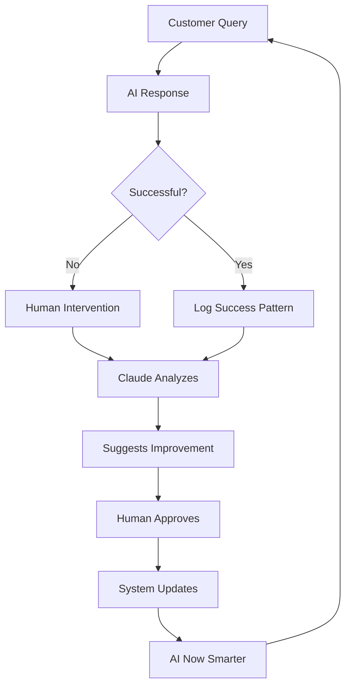

# ClubOS V2 Strategic Implementation & Safeguards

## Strategic Position: Recursive AI Automation

### Core Competitive Advantage
```
Traditional: Human → Task → Human Review → Improvement (weeks)
ClubOS V2: AI → Task → AI Analysis → AI Improvement (hours)
```

## Recursive Loop Architecture

### 1. The Self-Improving System


### 2. Scale Economics
```typescript
// Traditional scaling
const scaleTraditional = (locations: number) => ({
  staffNeeded: locations * 3, // Support staff per location
  trainingTime: 2 * 7 * 8, // 2 weeks training per person
  monthlyCost: locations * 3 * 4000, // Salary per person
  responseQuality: 'variable' // Depends on individual
});

// ClubOS V2 scaling
const scaleClubOS = (locations: number) => ({
  staffNeeded: 2, // Total oversight staff
  trainingTime: 0, // AI learns from patterns
  monthlyCost: 2 * 6000 + (apiCosts), // Oversight + API
  responseQuality: 'consistent' // Same AI everywhere
});

// At 10 locations:
// Traditional: 30 staff, $120k/month
// ClubOS: 2 staff, $15k/month
// Savings: $105k/month = $1.26M/year
```

## Required Safeguards Implementation

### 1. Write-Ahead Logging (WAL)
```typescript
// services/claudeWAL.ts
export class ClaudeWriteAheadLog {
  async proposeChange(change: ProposedChange): Promise<ChangeLog> {
    // 1. Generate diff BEFORE any action
    const diff = await this.generateDiff(change);
    
    // 2. Create immutable plan
    const plan = {
      id: uuidv4(),
      timestamp: new Date().toISOString(),
      proposedBy: 'claude',
      targetFile: change.targetFile,
      currentSHA: await this.calculateSHA(change.targetFile),
      proposedSHA: await this.calculateProposedSHA(change),
      diff: diff,
      reasoning: change.reasoning,
      relatedTickets: change.ticketIds,
      rollbackPlan: this.generateRollback(change)
    };
    
    // 3. Write immutable log entry
    await this.writeImmutableLog(plan);
    
    // 4. Return for approval
    return plan;
  }
  
  private async writeImmutableLog(plan: ChangePlan) {
    // Write to append-only log
    const logPath = `logs/claude-wal/${plan.timestamp}-${plan.id}.json`;
    await fs.writeFile(logPath, JSON.stringify(plan, null, 2));
    
    // Also write to database with immutable flag
    await db.query(`
      INSERT INTO claude_wal 
      (id, plan, created_at, immutable) 
      VALUES ($1, $2, NOW(), true)
    `, [plan.id, plan]);
  }
}
```

### 2. Git Branch Isolation
```typescript
// services/claudeGitSafety.ts
export class ClaudeGitSafety {
  private readonly ALLOWED_BRANCH_PREFIX = 'autogen/';
  private readonly FORBIDDEN_BRANCHES = ['main', 'master', 'production'];
  
  async executeWithSafety(operation: ClaudeOperation): Promise<Result> {
    // 1. Verify not on protected branch
    const currentBranch = await git.currentBranch();
    if (this.FORBIDDEN_BRANCHES.includes(currentBranch)) {
      throw new Error('Claude cannot operate on protected branches');
    }
    
    // 2. Create isolated branch
    const branchName = `${this.ALLOWED_BRANCH_PREFIX}${operation.type}-${Date.now()}`;
    await git.checkout('-b', branchName);
    
    try {
      // 3. Execute with rollback protection
      const result = await this.executeInSandbox(operation);
      
      // 4. Create PR, never direct merge
      await this.createPullRequest({
        branch: branchName,
        title: `[Claude] ${operation.description}`,
        body: this.formatPRBody(operation, result)
      });
      
      return result;
    } catch (error) {
      // Automatic cleanup on failure
      await git.checkout('main');
      await git.branch('-D', branchName);
      throw error;
    }
  }
}
```

### 3. Structured Reasoning Logs
```typescript
// interfaces/claudeReasoning.ts
interface ClaudeReasoning {
  version: '1.0';
  timestamp: string;
  traceId: string;
  
  analysis: {
    problemIdentified: string;
    patternsFound: string[];
    confidenceScore: number;
    samplesAnalyzed: number;
  };
  
  proposal: {
    changeType: 'sop_update' | 'knowledge_add' | 'route_adjustment';
    targetComponent: string;
    currentState: string;
    proposedState: string;
    expectedImprovement: string;
  };
  
  validation: {
    testsRun: string[];
    testResults: Record<string, boolean>;
    edgeCasesConsidered: string[];
    rollbackPlan: string;
  };
  
  metadata: {
    relatedTickets: string[];
    affectedUsers: number;
    similarPastChanges: ChangeReference[];
  };
}

// Every Claude decision must produce this
async function claudeDecision(input: AnalysisInput): Promise<ClaudeReasoning> {
  const reasoning: ClaudeReasoning = {
    version: '1.0',
    timestamp: new Date().toISOString(),
    traceId: input.traceId,
    // ... structured reasoning
  };
  
  // Log before action
  await this.logReasoning(reasoning);
  
  return reasoning;
}
```

### 4. SHA Validation Chain
```typescript
// services/shaValidator.ts
export class SHAValidator {
  async validateBeforeWrite(
    file: string, 
    expectedSHA: string, 
    newContent: string
  ): Promise<ValidationResult> {
    // 1. Calculate current SHA
    const currentContent = await fs.readFile(file, 'utf-8');
    const currentSHA = crypto
      .createHash('sha256')
      .update(currentContent)
      .digest('hex');
    
    // 2. Verify matches expected
    if (currentSHA !== expectedSHA) {
      return {
        valid: false,
        error: 'File changed since analysis',
        currentSHA,
        expectedSHA,
        action: 'abort'
      };
    }
    
    // 3. Calculate new SHA for audit
    const newSHA = crypto
      .createHash('sha256')
      .update(newContent)
      .digest('hex');
    
    // 4. Log the transition
    await this.logSHATransition({
      file,
      fromSHA: currentSHA,
      toSHA: newSHA,
      timestamp: new Date(),
      content: newContent
    });
    
    return {
      valid: true,
      fromSHA: currentSHA,
      toSHA: newSHA
    };
  }
}
```

## Strategic Implementation Phases

### Phase 1: Foundation (Week 1-2)
- Implement WAL system
- Set up git branch isolation
- Create reasoning log structure
- Deploy SHA validation

### Phase 2: Recursive Loop (Week 3-4)
- Connect feedback to Claude analysis
- Implement approval UI
- Set up automated testing
- Deploy to single location

### Phase 3: Scale Testing (Week 5-6)
- Monitor improvement velocity
- Measure cost savings
- Track error reduction
- Validate safety mechanisms

### Phase 4: Multi-Location Rollout (Week 7-8)
- Deploy to all locations
- Monitor cross-location learning
- Optimize API costs
- Reduce human oversight

## ROI Projections

### Year 1 (10 locations)
```
Traditional Costs:
- Staff: $1.26M (30 people)
- Training: $100k
- Errors/Inconsistency: $200k
Total: $1.56M

ClubOS V2 Costs:
- Oversight Staff: $144k (2 people)
- API Costs: $60k
- Development: $100k (one-time)
Total: $304k

Savings: $1.256M (80% reduction)
```

### Competitive Moat
1. **Learning Velocity**: System improves daily vs quarterly training
2. **Consistency**: Same quality across all locations
3. **24/7 Availability**: No shifts or overtime
4. **Knowledge Retention**: Never forgets, always improves

This architecture creates an exponentially improving system with strict safety controls!