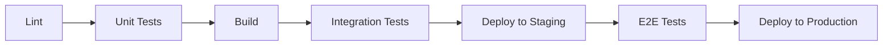

# Testing Strategy & Build Pipeline

## 🎯 When to Run Tests

### Current Setup: Tests Run BEFORE Build/Deploy
```yaml
jobs:
  test:        # Runs first
  deploy:      # Only runs if tests pass
    needs: test
```

### Why Tests First? (Recommended ✅)

**Pros:**
- **Fail fast** - Don't waste time building broken code
- **Cheaper** - Catch errors before expensive build/deploy steps
- **Safer** - Prevents broken code from reaching production
- **Clearer** - Developers know immediately what's wrong

**Cons:**
- Slightly slower feedback for syntax errors (caught by tests anyway)

### Alternative: Tests After Build ❌

**Pros:**
- Faster initial feedback on build errors
- Can test the actual built artifacts

**Cons:**
- Wastes resources building broken code
- Longer total pipeline time
- Risk of deploying untested code if pipeline fails

## 📋 Recommended Pipeline Order



1. **Lint** (5s) - Catch style issues
2. **Unit Tests** (20s) - Catch logic errors
3. **Build** (40s) - Only if code is correct
4. **Integration Tests** (30s) - Test with real dependencies
5. **Deploy Staging** (60s) - Safe environment
6. **E2E Tests** (2m) - Test full user flows
7. **Deploy Production** (60s) - Only if everything passes

## 🚀 Optimization Strategies

### 1. Parallel Execution
```yaml
test:
  strategy:
    matrix:
      test-suite: [unit, integration, lint]
```

### 2. Fail Fast
```yaml
test:
  fail-fast: true  # Stop all jobs if one fails
```

### 3. Conditional Testing
```yaml
- name: Run tests
  if: |
    contains(github.event.head_commit.message, '[skip-tests]') == false
```

### 4. Changed Files Only (PRs)
```bash
# In PR workflows
npm test -- --changedSince=origin/main
```

## 📝 Local Development

### Pre-commit (Fast)
```bash
# .husky/pre-commit
npm run lint:staged
npm test -- --findRelatedTests
```

### Pre-push (Thorough)
```bash
# .husky/pre-push
npm run lint
npm test
```

## 🔧 Configuration

### package.json Scripts
```json
{
  "scripts": {
    "test": "jest",
    "test:watch": "jest --watch",
    "test:coverage": "jest --coverage",
    "test:ci": "jest --ci --coverage --maxWorkers=2",
    "test:changed": "jest --onlyChanged",
    "test:staged": "jest --findRelatedTests",
    "lint": "eslint src/",
    "lint:fix": "eslint src/ --fix",
    "lint:staged": "lint-staged",
    "build": "npm run build:backend && npm run build:frontend",
    "prebuild": "npm test",  // Automatic test before build
    "ci": "npm run lint && npm test && npm run build"
  }
}
```

### GitHub Actions Workflow
```yaml
name: CI/CD Pipeline

on: [push, pull_request]

jobs:
  # Quick checks first
  lint:
    runs-on: ubuntu-latest
    steps:
      - uses: actions/checkout@v4
      - run: npm ci
      - run: npm run lint

  # Tests in parallel with lint
  test:
    runs-on: ubuntu-latest
    steps:
      - uses: actions/checkout@v4
      - run: npm ci
      - run: npm test:ci

  # Build only after tests pass
  build:
    needs: [lint, test]
    runs-on: ubuntu-latest
    steps:
      - uses: actions/checkout@v4
      - run: npm ci
      - run: npm run build
      
  # Deploy only after build succeeds
  deploy:
    needs: build
    if: github.ref == 'refs/heads/main'
    runs-on: ubuntu-latest
    steps:
      - run: npm run deploy
```

## 🎓 Best Practices

1. **Test Early, Test Often**
   - Run fast tests (unit) first
   - Save slow tests (E2E) for later

2. **Fail Fast**
   - Stop the pipeline as soon as something fails
   - Provide clear error messages

3. **Cache Aggressively**
   - Cache node_modules
   - Cache test results for unchanged files
   - Cache build artifacts

4. **Parallelize When Possible**
   - Run lint and tests simultaneously
   - Split large test suites

5. **Make It Optional (Rarely)**
   - Allow `[skip-ci]` for documentation changes
   - But use sparingly!

## 📊 Metrics to Track

- **Pipeline Duration**: Target < 5 minutes
- **Test Coverage**: Maintain > 80%
- **Failure Rate**: Should be < 5%
- **Time to Feedback**: First failure < 1 minute

---

**Bottom Line**: Tests should run FIRST to fail fast and save resources.